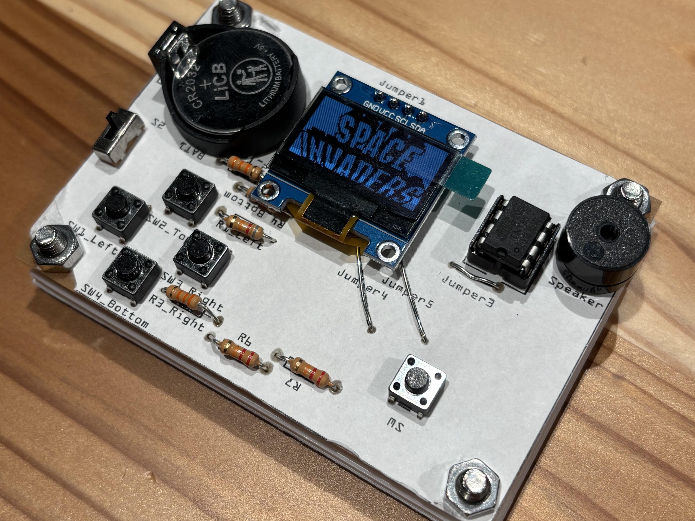

# DIY-GAMEHARD

## Overview  
**DIY-GAMEHARD** is a project where you can build your own gaming console through hands-on electronic crafting. This project is ideal for beginners and experienced makers who are interested in combining hardware soldering and software programming. By the end of the project, participants will have a fully functional game console that can be further customized.

---

## Features  
- **Custom Hardware:** Includes a specially designed PCB for easy assembly.  
- **Hands-On Experience:** Learn soldering and basic electronics by assembling the hardware.  
- **Programmable:** Use simple coding to develop or customize games for the console.  
- **Portable:** Compact design, perfect for playing and showcasing your work.  

---

## Components  

This project uses the following electronic components:

- **Resistors:**  
  - 88 kΩ × 2  
  - 33 kΩ × 2  
  - 22 kΩ × 2  
  - 10 kΩ × 1  

- **Switches:**  
  - Tactile switches × 5  
  - Power switch × 1  

- **Additional Components:**  
  - Speaker × 1  
  - Battery holder × 1  

- **Microcontroller and Accessories:**  
  - ATtiny85 microcontroller × 1  
  - CR2032 button battery × 1  
  - OLED display × 1  
  - Custom-designed PCB × 1  

These components work together to create a functional and customizable gaming device.  

---

## Requirements  
- Basic knowledge of soldering (guidance will be provided).  
- A soldering iron and solder.  
- A computer with Arduino IDE (or similar) installed for programming.  

---

## Assembly Instructions  
1. **Prepare the components:** Unpack the kit and organize the parts.  
2. **Solder the components:** Follow the step-by-step guide provided in the documentation.  
3. **Upload the game code:** Use Arduino IDE to upload sample game code to the microcontroller.  
4. **Test and play:** Ensure everything works and enjoy your custom-built game console!  

---

## Programming Guide  
- **Tools:**  
  - Arduino IDE or any compatible programming tool.  
- **Code Examples:**  
  Sample games and starter templates are included in the repository under the `examples/` folder.  
- **Customization:**  
  Modify the code to create your own games or tweak the existing ones.

---

## Contribution  
We welcome contributions to improve the project!  
- Report issues or suggest features in the [Issues](#) section.  
- Submit pull requests for bug fixes or new features.  

---

## License  
This project is licensed under the [MIT License](LICENSE).  

---

## Developer  
This project was developed by **Masahiro Higuchi**.  

---

## Contact  
For inquiries, feel free to contact:  
- a601023361@st.tachibana-u.ac.jp  
- masah762@gmail.com  

---

## References  
- [GameTiny Project on GitHub](https://github.com/cheungbx/gametiny)  
- [Tiny Joypad Production Guide](https://burariweb.info/electronic-work/tiny-joypad-production.html)  
- [TinyJoyPad Official Site](https://www.tinyjoypad.com/tinyjoypad_attiny85)  

---

## Acknowledgments  
Special thanks to Kyoto Tachibana University’s Creation Lab for designing the custom hardware and supporting this project.  
